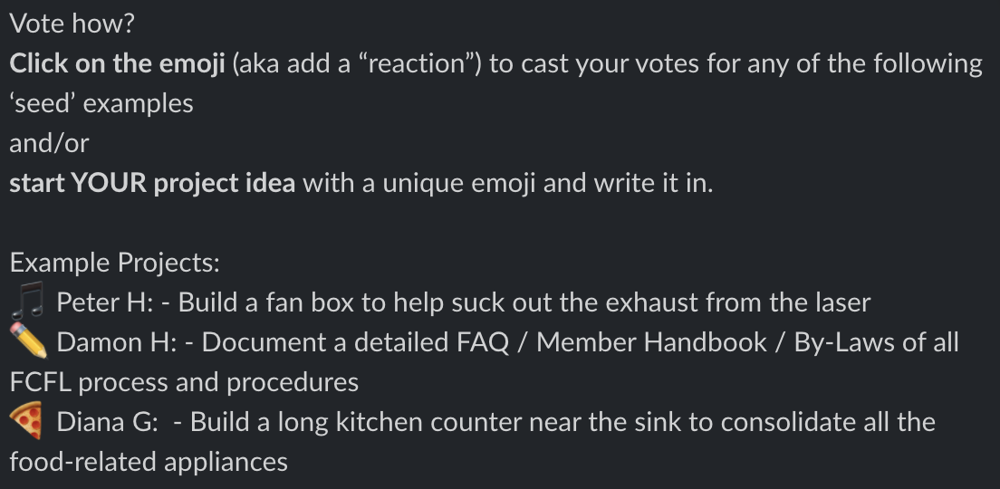

# Member-Led Improvement Projects

### WE WANT YOU to help make FCFL better with Member-Led Improvement Projects!

Propose and lead a lab improvement project and FCFL will PAY FOR IT - or simply VOTE for the projects you want most or would want to help with.

FCFL keeps its membership rates low because it is run by YOU, our members who volunteer to do things like reorganize, clean up, build things, or write the rules of how things should work. Propose anything you will champion to completion: e.g. a better dust collection system, scheduling system, designing a chore-board system, anything within budget.

### How does the process work?

* Every few months, the FCFL Board reviews the current state of finances and decides a max budget for the project.
* The board then requests proposal ideas from all the members \(within budget\). 
* Members vote on their favorite idea.
* The board notifies the winner to submit a detailed Project Proposal.
* In the case of a tie, all winning members are invited to submit Project Proposals.
* Board members review proposals at the next meeting and decide the winner\(s\) for this round. The board will defer unselected Proposals for the next round of voting if the member is still interested.

### Your Project Proposal should include:

* Goal and outcome of project.
* Project team Lead and any additional FCFL members \(if any\).
* Budget with materials used and cost estimate.
* Rough timeline or estimated project duration.
  * Hint: determine what you think it will take to complete your project, then multiply by three. It is better to finish early than be late.

### What if I win?

We’re here to help! We don’t have all the answers, but will help where and how we can.  

### The Fine Print:

* Member pays for project materials and submits receipts at the end of the project. Any receipts not submitted 60 days after the project’s original estimated completion date might not be reimbursed.
* Project Proposals not received within 2 weeks of notification shall be considered declined by the winner and the Board will vote to select another winner or rerun the public poll.
* Cost overage - Submitted receipt totals exceeding 120% of max budget requires board approval. No guarantee whether or not the Member will be reimbursed for the total amount spent, so please watch your budget!
* Project timelines - Projects not completed and that exceed the Proposal timeline by three times will be considered abandoned and may or may not be reimbursed.

Things happen, but in all of the cases above, the board will review the circumstances and make a determination on how best to handle. Their determination will depend largely on the state of the project, quality of work, and communication from the Project Lead. The Lab board are volunteers who do this in good faith to support the continuation of the Lab’s mission.

### How does voting work? 

In Slack, click on the emoji \(aka add a “reaction”\) to cast your votes for any of the following ‘seed’ examples and/or start YOUR project idea with a unique emoji and write it in.

Example:

